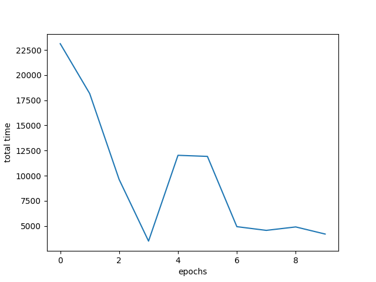

# TrafficLightSystemRL-DLW2022-VAlly
This repository contains codes for AATLaS, the Auto-Adaptive Traffic Light System to optimize traffic flow from every junction of Singapore. This is a project for the DLW Hackaton 2022 hosted by MLDA@EEE.

## Problem statement
<p align="center">  </p>
Consider the problem: we have a busy crossroad with 4 traffic light clusters. We have traffic camera(s) that can give us information about the direction each car is travelling. What is the optimal green-light time for each travelling direction at the crossroad?

## Approach
AATLaS utilizes the data from the camera(s) to perform 2 steps:

1. Using the camera data, infer the traffic flow for each of the 12 possible travelling directions at the crossroad.
2. From the traffic flow, calculate the optimal green-light time for one of the two sides of the crossroad.

The first step is performed with a deep neural network model for object detection and tracking. The second step is performed with a deep reinforcement learning model to calculate the green-light time.

## Set up
### Set up repo
```
git clone https://github.com/JohnToro-CZAF/TrafficLightSystemRL-DLW2022-VAlly.git
```
Navigate to controlling for the deep reinforcement learning model.
### Dependencies
```
torch
numpy
matplotlib
sumo # sumo has some issue with MacOS laptop that may need further configuration
```
For quick installation, run
```
pip install -r requirements.txt
```
For visualization, you need to download SUMO GUI, which could be found [here](https://www.eclipse.org/sumo/). It is optional, as SUMO is used as a training environment only.
### Network and route file
The network file and route file for training data can be found in `controlling/maps/` folder. For training, we need to add them into the `configuration.sumocfg` file.
```
<input>
  <net-file value='maps/city0.net.xml'/>
  <route-files value='maps/city0.rou.xml'/>
</input>
```
## Training
For step 1, we refered to this paper "Zero-VIRUS: Zero-shot VehIcle Route Understanding System for Intelligent Transportation"<sup>[1]</sup>, and used transfer learning to re-trained the model with our custom dataset.

For step 2, we first created SUMO simulation based on real-life traffic data. For the model, we built a Deep Q-Network. We then train the model in that simulated environment. The model was trained in 10 epochs with 200 steps.

## Result
Lost function of the controlling model (total waiting time at crossroad):
<p align="center">  </p>

## Demo
* [Video](youtube.com)

* [Devpost submission](https://devpost.com/software/tls)

## References
[1] L. Yu, Q. Feng, Y. Qian, W. Liu and A. G. Hauptmann, "Zero-VIRUS: Zero-shot Vehicle Route Understanding System for Intelligent Transportation," <i>2020 IEEE/CVF Conference on Computer Vision and Pattern Recognition Workshops (CVPRW)</i>, 2020, pp. 2534-2543, doi: 10.1109/CVPRW50498.2020.00305.

To find out more about deep reinforcement learning, refer to V. Mnih et al., "Playing Atari with Deep Reinforcement Learning," 12/19 2013
